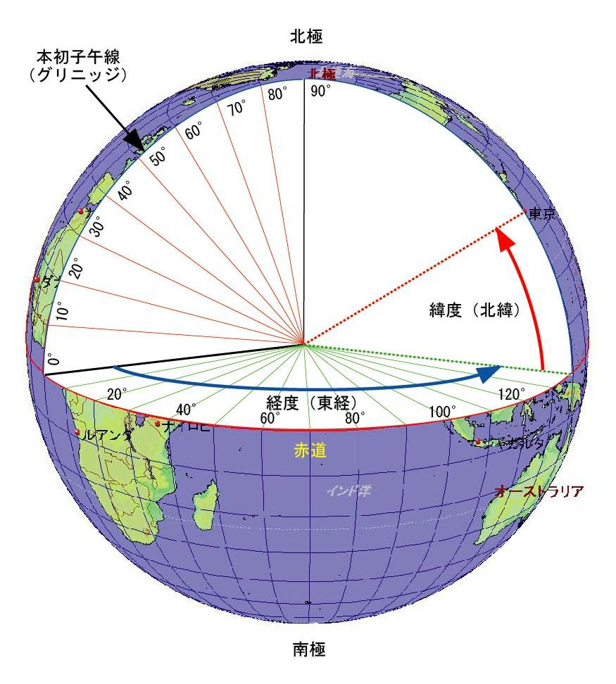
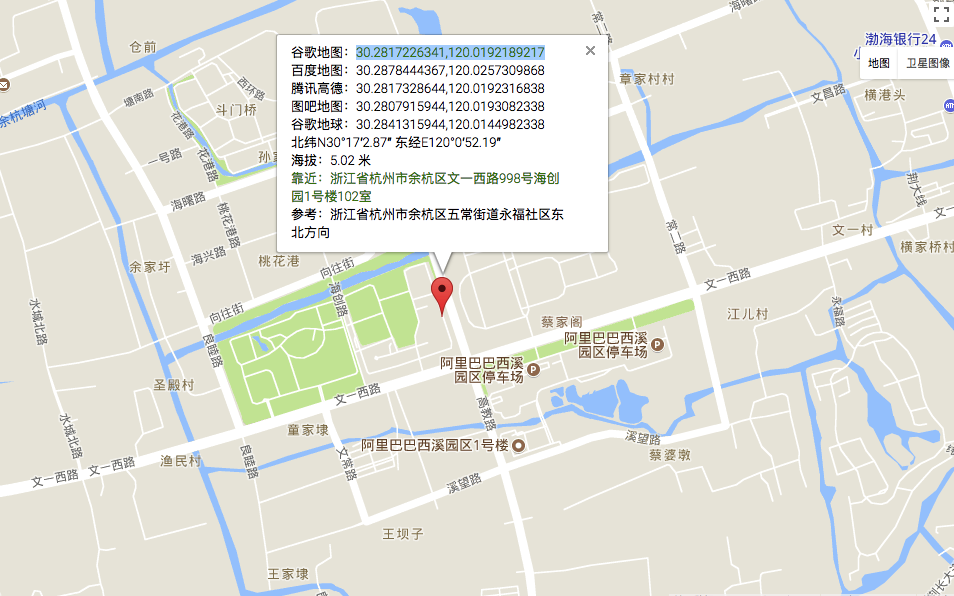
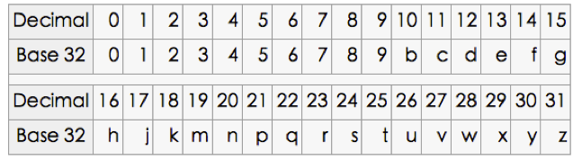
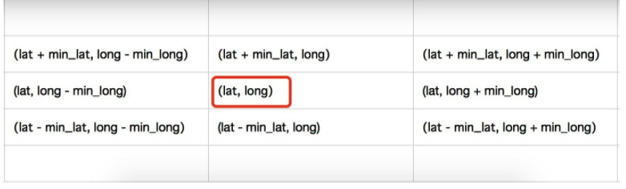

## 地理信息算法

### 1. 经纬度

### 2. GeoHash算法

geohash简单来说就是将一个地理坐标转换为一个可比较的字符串的算法。

1）GeoHash将二维的经纬度转换成字符串，比如下图展示了北京9个区域的GeoHash字符串，分别是WX4ER，WX4G2、WX4G3等等，每一个字符串代表了某一矩形区域。也就是说，这个矩形区域内所有的点（经纬度坐标）都共享相同的GeoHash字符串。

        

2）字符串越长，表示的范围越精确。

3）字符串相似的表示距离相近（特殊情况后文阐述），这样可以利用字符串的前缀匹配来查询附近的POI信息。

#### 2.1 GeoHash算法的步骤

geoHash算法采用的是二分逼近法。以我工作的地点海创园为例介绍

1. 计算维度编码：30.281723

   | **min**    | **mid**    | **max**    | **bit** |
   | ---------- | ---------- | ---------- | ------- |
   | -90        | 0          | 90         | 1       |
   | 0          | 45         | 90         | 0       |
   | 0          | 22.5       | 45         | 1       |
   | 22.5       | 33.75      | 45         | 0       |
   | 22.5       | 28.125     | 33.75      | 1       |
   | 28.125     | 30.9375    | 33.75      | 0       |
   | 28.125     | 29.53125   | 30.9375    | 1       |
   | 29.53125   | 30.234375  | 30.9375    | 1       |
   | 30.234375  | 30.5859375 | 30.9375    | 0       |
   | 30.234375  | 30.4101563 | 30.5859375 | 0       |
   | 30.234375  | 30.3222657 | 30.4101563 | 0       |
   | 30.234375  | 30.2783204 | 30.3222657 | 1       |
   | 30.2783204 | 30.3002931 | 30.3222657 | 0       |
   | 30.2783204 | 30.2893068 | 30.3002931 | 0       |
   | 30.2783204 | 302838136  | 30.2893068 | 0       |

   维度编码：10101011000100

   **区间范围划分：[min, mid)  [mid, max]**

2. 计算经度编码：120.019219

| **min**    | **mid**    | **max**    | **bit** |
| ---------- | ---------- | ---------- | ------- |
| -180       | 0          | 180        | 1       |
| 0          | 90         | 180        | 1       |
| 90         | 135        | 180        | 0       |
| 90         | 112.5      | 135        | 1       |
| 112.5      | 123.75     | 135        | 0       |
| 112.5      | 118.125    | 123.75     | 1       |
| 118.125    | 120.9375   | 123.75     | 0       |
| 118.125    | 119.53125  | 120.9375   | 1       |
| 119.53125  | 120.234375 | 120.9375   | 0       |
| 119.53125  | 119.882813 | 120.234375 | 1       |
| 119.882813 | 120.058594 | 120.234375 | 0       |
| 119.882813 | 119.970704 | 120.058594 | 1       |
| 119.970704 | 120.014649 | 120.058594 | 1       |
| 120.014649 | 120.036622 | 120.058594 | 0       |
| 120.014649 | 120.025636 | 120.036622 | 0       |

经度编码：11010101010110

3. 组码：偶数位放经度，奇数位放纬度，把2串编码组合生成新串

   1110011001100111001000111000

   **组码时长度不足的经纬度编码先用0补全，再组码**

4. base32编码

   

   11100 11001 10011 10010 00111 00000 转为28 25 19 18 7 0

   base32转码后：wtmk70

#### 2.2 Base32编码长度与精度

| **geohash长度** | **Lat位数** | **Lng位数** | **Lat误差** | **Lng误差** | **km误差** |
| --------------- | ----------- | ----------- | ----------- | ----------- | ---------- |
| 1               | 2           | 3           | ±23         | ±23         | ±2500      |
| 2               | 5           | 5           | ± 2.8       | ±5.6        | ±630       |
| 3               | 7           | 8           | ± 0.70      | ± 0.7       | ±78        |
| 4               | 10          | 10          | ± 0.087     | ± 0.18      | ±20        |
| 5               | 12          | 13          | ± 0.022     | ± 0.022     | ±2.4       |
| 6               | 15          | 15          | ± 0.0027    | ± 0.0055    | ±0.61      |
| 7               | 17          | 18          | ±0.00068    | ±0.00068    | ±0.076     |
| 8               | 20          | 20          | ±0.000086   | ±0.000172   | ±0.01911   |
| 9               | 22          | 23          | ±0.000021   | ±0.000021   | ±0.00478   |
| 10              | 25          | 25          | ±0.00000268 | ±0.00000536 | ±0.0005971 |
| 11              | 27          | 28          | ±0.00000067 | ±0.00000067 | ±0.0001492 |
| 12              | 30          | 30          | ±0.00000008 | ±0.00000017 | ±0.0000186 |

#### 2.3 geohash算法原理

如图所示，我们将二进制编码的结果填写到空间中，当将空间划分为四块时候，编码的顺序分别是左下角00，左上角01，右下脚10，右上角11，也就是类似于Z的曲线，当我们递归的将各个块分解成更小的子块时，编码的顺序是自相似的（分形），每一个子快也形成Z曲线，这种类型的曲线被称为Peano空间填充曲线。

这种类型的空间填充曲线的优点是将二维空间转换成一维曲线（事实上是分形维），对大部分而言，编码相似的距离也相近， 但Peano空间填充曲线最大的缺点就是突变性，有些编码相邻但距离却相差很远，比如0111与1000，编码是相邻的，但距离相差很大。

除Peano空间填充曲线外，还有很多空间填充曲线，如图所示，其中效果公认较好是Hilbert空间填充曲线，相较于Peano曲线而言，Hilbert曲线没有较大的突变。为什么GeoHash不选择Hilbert空间填充曲线呢？Peano曲线思路以及计算上比较简单，事实上，Peano曲线就是一种四叉树线性编码方式。

#### 2.4 **使用注意点**

由于GeoHash是将区域划分为一个个规则矩形，并对每个矩形进行编码，这样在查询附近POI信息时会导致以下问题，比如红色的点是我们的位置，绿色的两个点分别是附近的两个餐馆，但是在查询的时候会发现距离较远餐馆的GeoHash编码与我们一样（因为在同一个GeoHash区域块上），而较近餐馆的GeoHash编码与我们不一致。这个问题往往产生在边界处

解决方案：除了使用定位点的GeoHash编码进行匹配外，还使用周围8个区域的GeoHash编码，这样可以避免这个问题。

### S2 算法

关于 S2 算法，S2 算法较为复杂，之后会慢慢补充。

### 4. 参考文章

- [GeoHash核心原理解析](http://www.cnblogs.com/LBSer/p/3310455.html)

